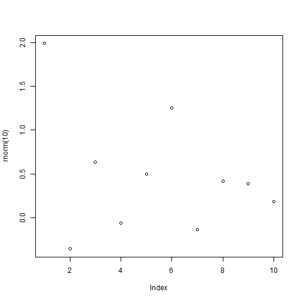

---
title       : ggplot2 redux
subtitle    : random things I like
author      : Marcus Beck
logo        : epa-seal.png
job         : ORISE post-doc
framework   : io2012        # {io2012, html5slides, shower, dzslides, ...}
highlighter : highlight.js  # {highlight.js, prettify, highlight}
hitheme     : tomorrow      # 
widgets     : []            # {mathjax, quiz, bootstrap}
mode        : selfcontained # {standalone, draft}

---&twocol w1:20% w2:80%

## To cover

***=left

- list
- on the left 
- side

***=right
- list
- on the right
- side

--- &twocol w1:50% w2:50%

## R Code Chunk Example

***=left
Some data and a plot:


```r
plot(rnorm(10))
```

***=right
 
